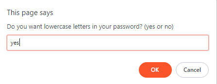
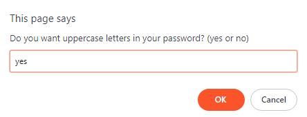
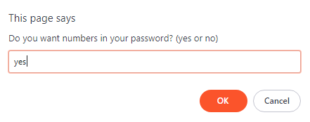
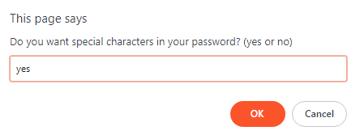
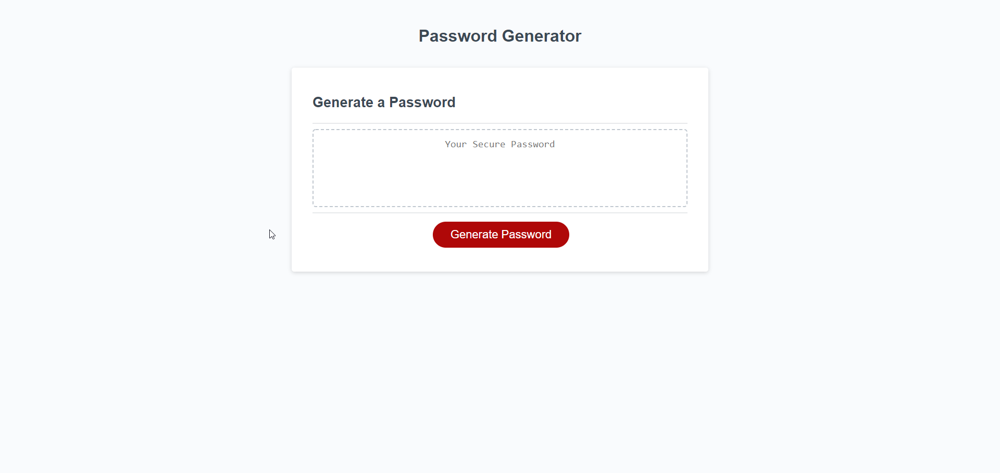
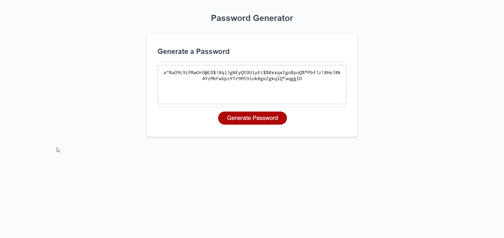

# Password Generator

Simple random password generator that creates password between 8 and 128 characters. The user is asked a series of prompts which includes number of characters for password, if upper case, lower case, numbers, and special characters should be included in password. After user completes the prompt, user clicks on generate password button and password in generated. 

**URL**: https://davidkd5.github.io/password_generator/

*Example of functionality is included below:*

